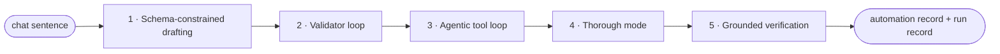
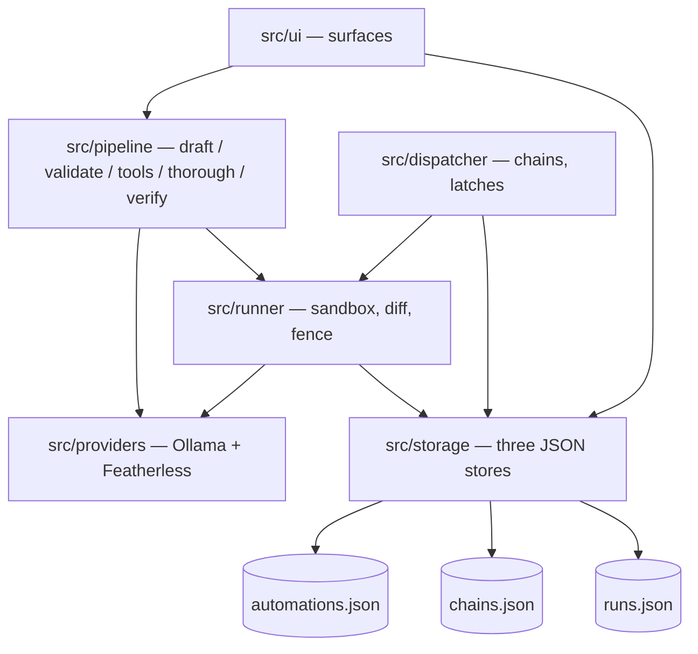

# Private Pilot — automations that never leave your computer

Ask for a job in plain English — "check the Solana price and tell me",
"every morning, headlines about space launches, then email me a one-liner" —
and a local AI compiles it into an **automation record you can read**, runs
it, and pops the answer right in the app. Watchers check prices while you
work and fire exactly once when a line is crossed. Local by default
(Ollama), cloud by choice (Featherless.ai) — and the UI never lies about
where compute happens.

## 60-second quickstart

1. Install [Node 20+](https://nodejs.org) and [Ollama](https://ollama.com), then:

```bash
ollama pull qwen3.5:9b
```

2. Install and run:

```bash
npm i
```

```bash
npm run tauri dev
```

3. Optional: paste a [Featherless.ai](https://featherless.ai) key in Settings
   to borrow cloud compute — it's off by default and the UI says so honestly.

> First run needs Rust + VS Build Tools (Tauri v2). See
> [prerequisites](https://tauri.app/start/prerequisites/).
> Or skip the toolchain: `npm run tauri build` produces
> `src-tauri/target/release/bundle/nsis/Private Pilot_0.1.0_x64-setup.exe`
> (and an MSI) — the packaged app is verified against Ollama from its own
> origin, where naive `window.fetch` integrations die of CORS.

---

## Inspiration

Every automation tool wants your data in their cloud — and the local-first
wave is drifting cloudward. n8n's own hosting docs warn that self-hosting
"requires technical knowledge" and reviewers measure 4–10 hours to a first
non-trivial workflow; the loudest complaint on its forums is silent failure.
Zapier's run history tells you a Zap *succeeded* but makes you dig for what
it actually *found*. The white space: **no server, no node graph,
sentence-based building, answers-first surfaces, watched-run trust, and a
provable "nothing left this computer."**

## What it does

- **Tell it**: type "check the Bitcoin price, then email me a one line
  summary" — a local model compiles it into a strict-JSON automation record
  drawn from a live-verified catalog of keyless public APIs (CoinGecko,
  Yahoo Finance, Open-Meteo, Google News RSS, HN, frankfurter.dev, status
  pages, TheSportsDB). The record is the documentation; every sentence the
  UI shows is read from it, never from model output at render time.
- **Answers land in the app**: the newest results sit at the top of
  Activity as cards — the price, the delta chip, a sparkline — and inline in
  chat when you run from there. Drafted emails get a **Send** button that
  opens your own mail app; nothing sends itself.
- **Starter gallery**: the empty state is eight curated automations — one
  click and your first result appears in seconds, zero setup, zero keys.
- **Chains**: named outputs map to named inputs — the baton values are shown
  crossing every hand-off, for real.
- **Watchers**: "email me when it drops below $75" is a latched crossing
  that fires exactly once, re-arms only after it crosses back (~1% slack),
  asks instead of guessing when the condition is already true, and says "It
  dipped while you were away" when it missed one.
- **Files, safely, in the background**: when a job does touch files, every
  run happens on a sandbox copy. A diff card shows added / changed / deleted
  with before→after hunks — nothing touches real files until you say
  **Keep** (and even Keep is undoable via `.pilot-versions`).
- **Never silent**: every failure state is a designed sentence in one of
  three families — stopped on purpose (gray), needs you (amber), broke (red).
  A rate-limited API is "asked us to slow down", never a price of 0.
- **Editable skills**: "make it 7am" renders a before→after card (JSON Merge
  Patch under the hood) with Keep it / Put it back and ten versions of
  history. The sheet is the readable truth; every row's Change link seeds
  chat with the row quoted.

## How we built it

Vite + React + TypeScript in Tauri v2, with zero custom Rust beyond five
small mechanism-only commands the fs plugin can't express (scope-allow at
pick time, fsync'd atomic write, a fast preflight walk, real-bytes recursive
copy — never hard links). All native needs are official plugins:
`plugin-fs`, `plugin-dialog`, `plugin-http` (every network call routes
through Rust — never `window.fetch`, which dies on the packaged origin's
CORS). Storage is exactly three JSON files written temp-file-then-rename
with Defender-lock backoff. No CSS framework, no component library — the
design system is a tokens file lifted from the build pack.

### The five-stage inference pipeline



| # | Stage | What it does | Config (local) |
|---|-------|--------------|----------------|
| 1 | Schema-constrained drafting | Strict JSON schema + closed catalog of real files and automations — the model can only propose what exists. | `format:` schema · temp 0 · seed 7 · num_ctx 16384 |
| 2 | Validator loop | Parse → Zod validate → re-prompt with prettified violations, ≤3 passes; then a question card, never a crash. | `format:` schema · temp 0 · counters logged |
| 3 | Agentic tool loop | Model-driven file/web actions in a sandbox, ≤15 turns, 30-min timeout, recovered-call parsing, truncation guard. | `tools`, NO format · temp 0.6 · num_ctx 32768 · stream off |
| 4 | Thorough mode | A second pass where the model re-reads its own answer against the source before committing. | temp 0 · long-context cloud model optional |
| 5 | Grounded verification | Extracted numbers must appear in the fetched source text or the run blocks with "I couldn't confirm that number." | plain code + one temp-0 check |

### The module map



## Data model

Exactly three JSON stores — no database. Trimmed record:

```json
{
  "id": "auto-x7k2",
  "name": "Invoice totals",
  "sentence": "Reads new invoices in Downloads and adds each total to invoices-2026.xlsx.",
  "category": "Documents",
  "steps": ["Open each new PDF in Downloads", "Find the total", "Append vendor+total to the sheet"],
  "inputs": [{ "name": "month", "label": "Which month", "example": "July" }],
  "outputs": [{ "name": "vendor" }, { "name": "amount" }, { "name": "how_many" }],
  "files": { "reads": ["~/Downloads"], "writes": ["~/Documents/invoices-2026.xlsx"] },
  "sources": ["api.coingecko.com"],
  "delivers": "answer",
  "schedule": { "trigger": "daily", "hour": 8 },
  "model": "qwen3.5:9b",
  "compiledBy": "qwen3.5:9b",
  "lastRun": { "at": 1755212520, "status": "ok", "summary": "3 new invoices, $1,240" }
}
```

`runs.json` is append-only and doubles as the chain checkpoint and the UI's
anchor ids — "send me the exact line where it broke" works.

## Cloud compute: Featherless.ai (opt-in)

Base URL: `https://api.featherless.ai/v1` (OpenAI-compatible,
`POST /v1/chat/completions`). The key is stored locally and requests route
through Rust (plugin-http), so it never lives in frontend code.

Pinned models (live-verified against the catalog):

| Model | Role |
|-------|------|
| `Qwen/Qwen3-32B` | Cloud default — native tool calling |
| `Qwen/Qwen2.5-7B-Instruct` | The mirror trick — the exact same weights as local `qwen2.5:7b`: one toggle, same brain, different computer |
| `zai-org/GLM-4.7-Flash` | Long-context thorough mode (202,752-token context) |
| `moonshotai/Kimi-K2.6` | Showcase (262K context) |
| `Qwen/Qwen3-VL-8B-Instruct` | Vision |

Featherless's FAQ, verbatim: *"We do not log any of the prompts or completions
sent to our API."* The Settings toggle reads: **"Borrow cloud compute
(Featherless) — this leaves your computer."** Default OFF; every "runs on this
computer" line in the UI changes the moment it's on — the UI never lies about
where compute happens.

## Challenges we ran into

Engineering honesty, straight from [NOTES.md](NOTES.md):

- **The think channel ate whole responses.** qwen3.5 is a thinking model —
  under `format:` grammar it spent entire turns thinking and returned empty
  content, twice (drafting, then again in the tool loop). `think: false` on
  those calls fixed it; the validator loop caught it honestly meanwhile.
- **The 16k drafting context silently truncated drafts.** The file catalog
  rode in the call twice (schema enums + a prompt listing), the draft got
  cut mid-JSON, and the "fix only the fields listed" retry then faithfully
  preserved the wrong single-automation shape. One draft took 199s; after
  cutting the duplicate and capping the catalog, 7–29s.
- **Tauri's http scope ignores ports in `**` patterns** — every Ollama call
  died on "url not allowed" until explicit port-wildcard entries landed.
- **Grounded verification kept blocking honest answers**: a summed total
  appears in no source file (subset-sum in plain code fixed it), a rounded
  -0.78% isn't the source's -0.7789 (precision-aware match), and the user's
  own $75.34 threshold isn't in the fetched JSON at all (record text counts
  as trusted context).
- **Rate-limited APIs became fake data.** CoinGecko's keyless tier throttled
  us and the 9B reported "price = 0" rather than admitting failure — the
  loop prompt now forbids invented values, and watcher latches treat ≤0/NaN
  as "I can't read the price any more — fix ›", never as a reading.
- **A hung Ollama request froze the watcher heartbeat** — the 30-minute
  stall cap only ran between turns. Every provider call now carries its own
  timeout with a designed sentence.
- **The 9B wouldn't split "then email me" into a second automation** until
  the few-shot example mirrored the exact structure. Rules alone didn't
  land; one structurally-identical example did.

## Accomplishments that we're proud of

- All three demo rungs verified against reality — SHA256 hashes proving the
  real file never changed until Keep, a live CoinGecko price in chat in
  23s, and real baton values on screen crossing a chain hand-off.
- Every failure state in the app is a designed sentence in one of three
  families — no silent catch blocks anywhere in the codebase.
- The validator's argument with the model renders in the UI ("Draft 1 — 2
  fields wrong → asking it to fix them"): constrained decoding's scar
  tissue, made visible.
- A closed-catalog grammar that makes hallucinated file paths literally
  unsampleable, and a fence that refuses off-record hosts before any fetch.

## What we learned

- Small local models are compilers, not oracles: grammar for shape, a
  validator loop for content, plain code for arithmetic, and one temp-0
  check as the tiebreaker beats any amount of prompt pleading.
- Honesty is an architecture, not a tone — once every stop has a designed
  sentence and every displayed string traces to a stored record, debugging
  the product and demoing it become the same activity.
- Verify against live reality early: three of our pinned data sources were
  dead or blocked (Stooq, Binance-US, Reddit) before we wrote a line
  against them.

## What's next

- **The .pilot file** — an automation record is already one strict-JSON
  document; sharing is a double-click, with a "what this touches" card before
  anything activates.
- **Starter gallery** — 8–10 curated records rendered by the exact same UI.
- **Permission ledger** — a provable "nothing left this computer" screen.
- **Model passport** — re-runs under a different brain say so.
- **Scheduled digest** — the app reports on itself in plain language.

## Where this sits

| | Needs a server? | Building metaphor | What you trust | Where compute runs |
|---|---|---|---|---|
| n8n | Yes (self-host) | Node graph | The graph you wired | Your server |
| Activepieces | Yes | Node graph | The graph | Server |
| Windmill | Yes | Code + flows | Your code | Server |
| Huginn | Yes | Agents config | YAML-ish agents | Server |
| browser-use | Cloud drift | Scripts | A hosted browser | Their cloud |
| screenpipe | Local + telemetry | Recording | An archive of everything | Local (telemetry on) |
| **Private Pilot** | **No** | **A sentence → a readable record** | **The record + the diff card** | **Your machine (cloud only by a labeled switch)** |

## Citations

- [Ollama API docs](https://docs.ollama.com/api) — structured outputs
  (`format`), `keep_alive`, `num_ctx`, tool calling
- [Qwen model family](https://ollama.com/library/qwen3.5) — local models
- [Featherless.ai docs](https://docs.featherless.ai) — OpenAI-compatible API,
  concurrency-based plans, model catalog
- [Tauri v2](https://tauri.app) — shell, plugins fs/dialog/http
- [React](https://react.dev) + [Vite](https://vite.dev) — UI toolchain
- [zod v4](https://zod.dev) — schema + `z.toJSONSchema`
- [jsdiff](https://github.com/kpdecker/jsdiff) (`diff@9`) — before/after hunks
- [dir-compare](https://github.com/gliviu/dir-compare) — sandbox/real compare semantics
- [defuddle](https://github.com/kepano/defuddle) + [linkedom](https://github.com/WebReflection/linkedom) — page → clean text
- [unpdf](https://github.com/unjs/unpdf) — PDF text extraction
- [exceljs](https://github.com/exceljs/exceljs) — .xlsx read/append
- n8n hosting docs + community forum — the competition's own words
- Keyless data sources (all live-verified before baking in):
  [CoinGecko](https://www.coingecko.com/en/api),
  [Yahoo Finance chart API](https://query1.finance.yahoo.com/v8/finance/chart/AAPL),
  [Open-Meteo](https://open-meteo.com/),
  [frankfurter.dev](https://frankfurter.dev/),
  [HN Algolia](https://hn.algolia.com/api),
  Google News RSS, BBC RSS, Statuspage `status.json`,
  [TheSportsDB](https://www.thesportsdb.com/api.php)

*(Demo video link + Built With land here before submission.)*
