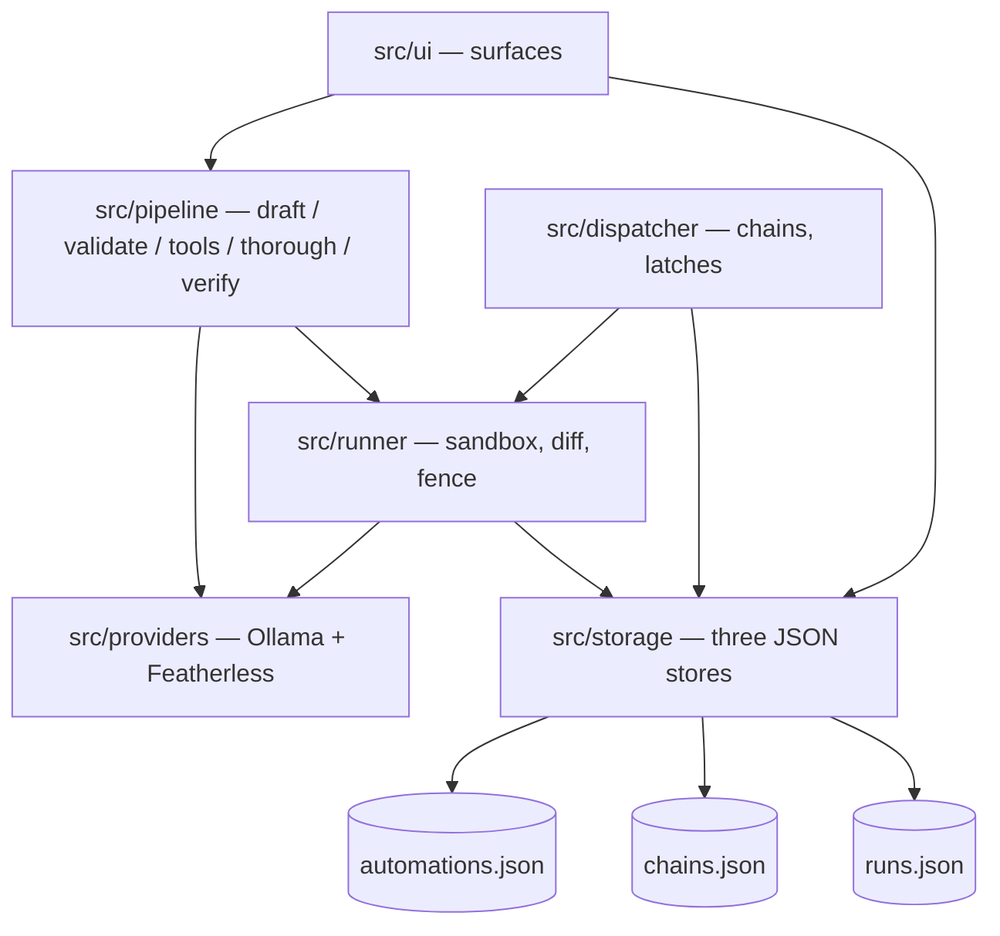

# Private Pilot — automations that never leave your computer

Describe a task in chat (or record yourself doing it) — a local AI compiles it
into an **automation record you can read**, run in a sandbox, watch, chain,
and keep. Local by default (Ollama), cloud by choice (Featherless.ai).

## 60-second quickstart

1. Install [Node 20+](https://nodejs.org) and [Ollama](https://ollama.com), then:

```bash
ollama pull qwen3.5:9b
```

2. Install and run:

```bash
npm i
```

```bash
npm run tauri dev
```

3. Optional: paste a [Featherless.ai](https://featherless.ai) key in Settings
   to borrow cloud compute — it's off by default and the UI says so honestly.

> First run needs Rust + VS Build Tools (Tauri v2). See
> [prerequisites](https://tauri.app/start/prerequisites/).

---

## Inspiration

Every automation tool wants your files in their cloud — and the local-first
wave is drifting cloudward. n8n's own hosting docs warn that self-hosting
"requires technical knowledge" and reviewers measure 4–10 hours to a first
non-trivial workflow; the loudest complaint on its forums is silent failure.
The white space: **no server, no node graph, sentence-based building,
watched-run trust, and a provable "nothing left this computer."**

## What it does

- **Tell it**: type "every morning read new invoices in Downloads, put the
  totals in my tracking sheet" — a local model compiles it into a strict-JSON
  automation record. The record is the documentation; every sentence the UI
  shows is read from it, never from model output at render time.
- **Watched runs**: every run happens on a sandbox copy of your folder.
  A diff card shows added / changed / deleted with before→after hunks —
  nothing touches real files until you say **Keep** (and even Keep is
  undoable via `.pilot-versions`).
- **Chains**: named outputs map to named inputs — the baton values are shown
  crossing every hand-off, for real.
- **Watchers**: "when the price crosses" is a latched condition that fires
  exactly once — and says so.
- **Never silent**: every failure state is a designed sentence in one of
  three families — stopped on purpose (gray), needs you (amber), broke (red).

## How we built it

Vite + React + TypeScript in Tauri v2, with zero custom Rust beyond two
sanctioned escape-hatch commands (fs-scope allow at pick time, fsync'd atomic
write). All native needs are official plugins: `plugin-fs`, `plugin-dialog`,
`plugin-http`. Storage is exactly three JSON files written
temp-file-then-rename. No CSS framework, no component library — the design
system is a tokens file.

### The five-stage inference pipeline


| # | Stage | What it does | Config (local) |
|---|-------|--------------|----------------|
| 1 | Schema-constrained drafting | Strict JSON schema + closed catalog of real files and automations — the model can only propose what exists. | `format:` schema · temp 0 · seed 7 · num_ctx 16384 |
| 2 | Validator loop | Parse → Zod validate → re-prompt with prettified violations, ≤3 passes; then a question card, never a crash. | `format:` schema · temp 0 · counters logged |
| 3 | Agentic tool loop | Model-driven file/web actions in a sandbox, ≤15 turns, 30-min timeout, recovered-call parsing, truncation guard. | `tools`, NO format · temp 0.6 · num_ctx 32768 · stream off |
| 4 | Thorough mode | A second pass where the model re-reads its own answer against the source before committing. | temp 0 · long-context cloud model optional |
| 5 | Grounded verification | Extracted numbers must appear in the fetched source text or the run blocks with "I couldn't confirm that number." | plain code + one temp-0 check |

### The module map



## Data model

Exactly three JSON stores — no database. Trimmed record:

```json
{
  "id": "auto-x7k2",
  "name": "Invoice totals",
  "sentence": "Reads new invoices in Downloads and adds each total to invoices-2026.xlsx.",
  "category": "Documents",
  "steps": ["Open each new PDF in Downloads", "Find the total", "Append vendor+total to the sheet"],
  "inputs": [{ "name": "month", "label": "Which month", "example": "July" }],
  "outputs": [{ "name": "vendor" }, { "name": "amount" }, { "name": "how_many" }],
  "files": { "reads": ["~/Downloads"], "writes": ["~/Documents/invoices-2026.xlsx"] },
  "sources": ["api.coingecko.com"],
  "delivers": "answer",
  "schedule": { "trigger": "daily", "hour": 8 },
  "model": "qwen3.5:9b",
  "compiledBy": "qwen3.5:9b",
  "lastRun": { "at": 1755212520, "status": "ok", "summary": "3 new invoices, $1,240" }
}
```

`runs.json` is append-only and doubles as the chain checkpoint and the UI's
anchor ids — "send me the exact line where it broke" works.

## Cloud compute: Featherless.ai (opt-in)

Base URL: `https://api.featherless.ai/v1` (OpenAI-compatible,
`POST /v1/chat/completions`). The key is stored locally and requests route
through Rust (plugin-http), so it never lives in frontend code.

Pinned models (live-verified against the catalog):

| Model | Role |
|-------|------|
| `Qwen/Qwen3-32B` | Cloud default — native tool calling |
| `Qwen/Qwen2.5-7B-Instruct` | The mirror trick — the exact same weights as local `qwen2.5:7b`: one toggle, same brain, different computer |
| `zai-org/GLM-4.7-Flash` | Long-context thorough mode (202,752-token context) |
| `moonshotai/Kimi-K2.6` | Showcase (262K context) |
| `Qwen/Qwen3-VL-8B-Instruct` | Vision |

Featherless's FAQ, verbatim: *"We do not log any of the prompts or completions
sent to our API."* The Settings toggle reads: **"Borrow cloud compute
(Featherless) — this leaves your computer."** Default OFF; every "runs on this
computer" line in the UI changes the moment it's on — the UI never lies about
where compute happens.

## Challenges we ran into

*(kept honest in [NOTES.md](NOTES.md) as we build — folded in at the end)*

## Accomplishments that we're proud of

*(filled at the end)*

## What we learned

*(filled at the end)*

## What's next

- **The .pilot file** — an automation record is already one strict-JSON
  document; sharing is a double-click, with a "what this touches" card before
  anything activates.
- **Starter gallery** — 8–10 curated records rendered by the exact same UI.
- **Permission ledger** — a provable "nothing left this computer" screen.
- **Model passport** — re-runs under a different brain say so.
- **Scheduled digest** — the app reports on itself in plain language.

## Where this sits

| | Needs a server? | Building metaphor | What you trust | Where compute runs |
|---|---|---|---|---|
| n8n | Yes (self-host) | Node graph | The graph you wired | Your server |
| Activepieces | Yes | Node graph | The graph | Server |
| Windmill | Yes | Code + flows | Your code | Server |
| Huginn | Yes | Agents config | YAML-ish agents | Server |
| browser-use | Cloud drift | Scripts | A hosted browser | Their cloud |
| screenpipe | Local + telemetry | Recording | An archive of everything | Local (telemetry on) |
| **Private Pilot** | **No** | **A sentence → a readable record** | **The record + the diff card** | **Your machine (cloud only by a labeled switch)** |

## Citations

- [Ollama API docs](https://docs.ollama.com/api) — structured outputs
  (`format`), `keep_alive`, `num_ctx`, tool calling
- [Qwen model family](https://ollama.com/library/qwen3.5) — local models
- [Featherless.ai docs](https://docs.featherless.ai) — OpenAI-compatible API,
  concurrency-based plans, model catalog
- [Tauri v2](https://tauri.app) — shell, plugins fs/dialog/http
- [React](https://react.dev) + [Vite](https://vite.dev) — UI toolchain
- [zod v4](https://zod.dev) — schema + `z.toJSONSchema`
- [jsdiff](https://github.com/kpdecker/jsdiff) (`diff@9`) — before/after hunks
- [dir-compare](https://github.com/gliviu/dir-compare) — sandbox/real compare semantics
- [defuddle](https://github.com/kepano/defuddle) + [linkedom](https://github.com/WebReflection/linkedom) — page → clean text
- [unpdf](https://github.com/unjs/unpdf) — PDF text extraction
- [exceljs](https://github.com/exceljs/exceljs) — .xlsx read/append
- n8n hosting docs + community forum — the competition's own words

*(Demo video link + Built With land here before submission.)*
