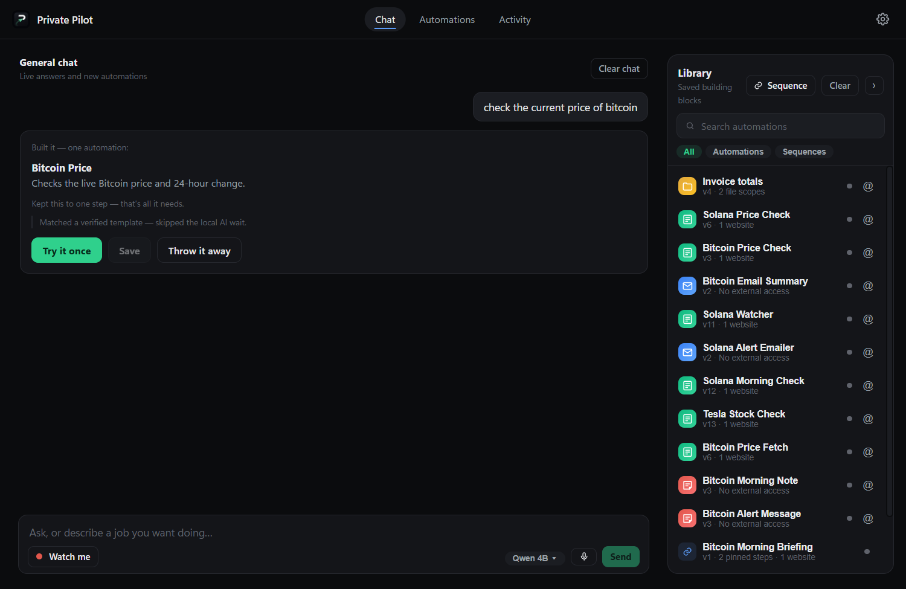
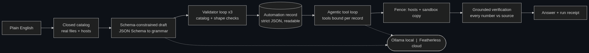
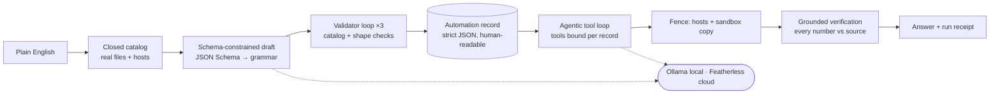
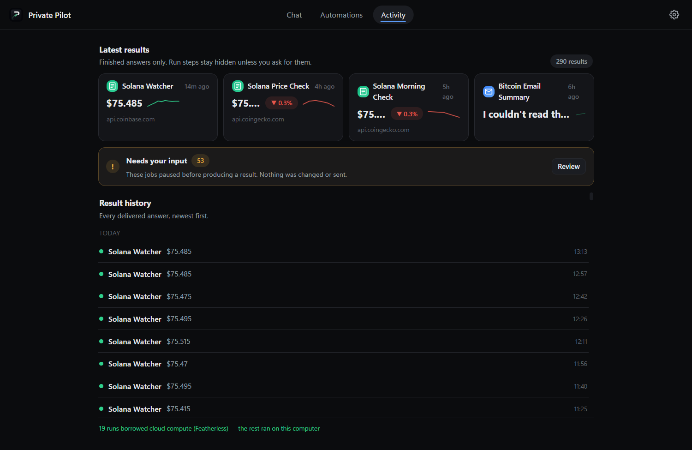
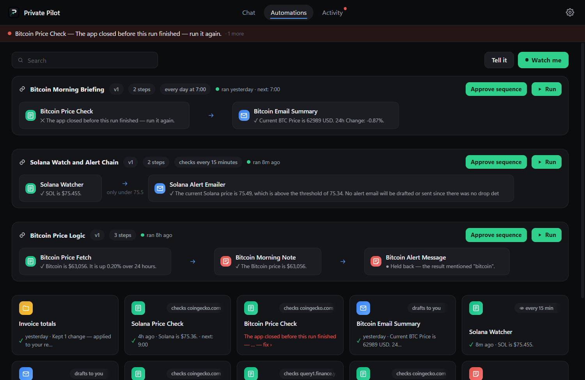

# Private Pilot

**A Windows app that turns a sentence into an automation you can read — and
runs it on your own machine.** A local model compiles plain English into a
strict-JSON record; that record, not the model, decides what runs. Nothing
leaves the computer unless you flip a labelled switch.

[](https://github.com/Awalker77s/PrivatePilot/actions/workflows/verify.yml)
[](LICENSE)



<sub>One sentence → a record you can audit → a watched run → an answer whose
every number was checked against the page it came from. No API key, no account,
no server.</sub>

<!-- After recording the demo, paste the PUBLIC video URL here as:
     > **Demo video:** https://... -->

| | |
|---|---|
| **Stack** | Tauri v2 · React 19 · TypeScript · Rust · Ollama · Featherless.ai |
| **Size** | ~26,000 lines across 100 source files |
| **Platform** | Windows 11 (WebView2) |
| **Team** | Alexander Walker · Mustapha Strachan · Ryan Schlosbon |
| **License** | [MIT](LICENSE) |
| **Built** | entirely inside the 48-hour window — first commit [`54ec863`](https://github.com/Awalker77s/PrivatePilot/commit/54ec863) at 6:27 PM CST, 27 minutes after kickoff — [full history](https://github.com/Awalker77s/PrivatePilot/commits/main) |

---

## Why it exists

Automation makes you choose: wire a node graph on a server you maintain, or
hand your files and your inbox to a cloud you can't inspect. Either way you end
up trusting something you can't read.

Doing it locally isn't hard because small models are weak. It's hard because
you get no **guarantees** — a 4B model will invent a filename without
hesitating. So this app doesn't ask it to behave. It removes the option:

> **The only filenames in the model's decoding grammar are the ones actually on
> your disk.** A hallucinated path isn't discouraged, it's *unsampleable*. With
> nothing indexed, the field it would name a file in compiles to `{"not": {}}` —
> a type no string inhabits.

Three more guarantees work the same way — each one a function in the codebase
rather than a sentence in a prompt. They are the whole project:
[**How it works ↓**](#how-it-works)

---

## Quickstart

**Prerequisites:** [Node 20+](https://nodejs.org), [Ollama](https://ollama.com),
and the [Tauri v2 prerequisites](https://tauri.app/start/prerequisites/)
(Rust + VS Build Tools on Windows).

```bash
ollama pull qwen3.5:4b          # the default brain — no key, no account
npm install
npm run tauri dev
```

That's the whole setup. No API key is required for anything in the demo: the
app ships a catalog of **keyless, live-verified public data sources**, so the
first automation works on a machine that has never been configured.

<details>
<summary>Optional extras</summary>

```bash
ollama pull gemma4:12b          # better screen/image reading for "Watch me"
```

- **Cloud compute:** paste a [Featherless.ai](https://featherless.ai) key in
  **Settings → Borrow cloud compute**, then pick a cloud model. Off by
  default, and the key stays in local settings on this machine.
- **Packaged build:** `npm run tauri build` produces an NSIS installer and an
  MSI under `src-tauri/target/release/bundle/`.
- **PowerShell:** use `npm.cmd` if script execution is restricted.
- **First run is slow** on CPU (a minute or two while the model loads);
  everything after is much faster.

</details>

---

## Verify it works — no model, no Rust toolchain, no API key

```bash
npm install && npm run verify
```

That type-checks the whole project and runs the regression suite (**83
assertions** covering the compiler's template path, chat routing, sequence
detection and growth, schedule parsing, and the file compiler's refusals). It needs no model, no
network at test time, and none of the Tauri prerequisites — which is why
[CI runs the same command on every push](https://github.com/Awalker77s/PrivatePilot/actions/workflows/verify.yml),
green on a clean Linux runner in under 30 seconds.

**Then try these in the app** — they exercise the hardest paths:

| Type this | What it proves |
|---|---|
| `check the current price of bitcoin` | compile → readable record → watched run → verified answer (instant — a verified template, no model turn) |
| `make a sequence of the bitcoin price and the weather in orlando` | two automations *and* the link between them, from one sentence |
| `connect Bitcoin Price Fetch and Bitcoin Morning Note` | connecting saved automations — deterministic, no model call |
| `summarize everything in my Downloads folder` | sandboxed file reading, PDFs included |

---

## How it works

A sentence becomes a **record**; the record — not the model — decides what runs.

Here is a real one out of `automations.json` on the machine this was built on.
*"Fetch the current Bitcoin price from CoinGecko"* compiled to this:

```json
{
  "id": "auto-th55fia",
  "name": "Bitcoin Price Fetch",
  "sentence": "Fetch the current Bitcoin price from CoinGecko and determine if it mentions 'bitcoin'.",
  "category": "Web",
  "steps": [
    "https://api.coingecko.com/api/v3/simple/price?ids=bitcoin&vs_currencies=usd&include_24hr_change=true",
    "answer with the price and state whether it mentions 'bitcoin'"
  ],
  "inputs": [],
  "outputs": [
    { "name": "price" },
    { "name": "mentions_bitcoin" }
  ],
  "files": { "reads": [], "writes": [] },
  "sources": ["api.coingecko.com"],
  "apps": [],
  "tools": [],
  "knowledge": [],
  "delivers": "answer",
  "schedule": { "trigger": "manual" },
  "model": "qwen3.5:4b",
  "effort": "quick",
  "compiledBy": "qwen3.5:4b",
  "permissions": {
    "filesystem": { "mode": "none", "reads": [], "writes": [] },
    "network": { "hosts": ["api.coingecko.com"] },
    "commands": [],
    "applications": [],
    "capabilities": []
  },
  "lastRun": {
    "at": 1786847506986,
    "status": "ok",
    "summary": "Bitcoin is $63,058. It is up 0.02% over 24 hours."
  },
  "revision": {
    "id": "rev-auto-th55fia-6-08ehie5",
    "number": 6,
    "contentHash": "08ehie5",
    "status": "published"
  }
}
```

<sub>Formatting only — object literals collapsed onto single lines, and
`origin`/`library` (timestamps and tags) dropped. No field values changed.</sub>

That document *is* the security model, and every field in it is load-bearing:

- **`sources`** is the fence. `fenceAllows()`
  ([src/runner/fetchPage.ts:32](src/runner/fetchPage.ts#L32)) checks every
  outbound request against this list, matching a host or a subdomain of it — so
  `evil-coingecko.com` fails the suffix test rather than sneaking through.
- **`files.reads` / `files.writes` are empty**, so no sandbox is staged, and
  `bindTools()` never puts `read_file` or `write_file` in front of the model at
  all ([src/runner/loop.ts:143](src/runner/loop.ts#L143)). It cannot misuse a
  tool it was never handed.
- **`permissions`** is the declared manifest, written at compile time and shown
  in the approval sheet: changing what an automation may touch is a visible
  edit, never a silent one.
- **`compiledBy`** records which model wrote this, and **`revision.contentHash`**
  changes whenever the automation does — which invalidates a stored approval,
  and lets a sequence pin the exact revision it was tested against.

A person can read all of it before it ever runs — and so can a reviewer.



<details>
<summary>Diagram source (Mermaid)</summary>



</details>

Four ideas do the work:

1. **A closed catalog.** Before the model is asked anything, the app lists the
   real folders, files and existing automations and bakes them into the JSON
   schema as enums. The model isn't *asked* to avoid inventing a filename — it
   is structurally unable to emit one. This is the schema the model actually
   receives, generated by `wireJsonSchema()`:

   ```json
   "reads": {
     "type": "array",
     "items": { "type": "string", "enum": ["~/Downloads", "~/Downloads/invoice-jan.pdf"] }
   }
   ```

   Two real paths, and no way to sample a third. With nothing indexed, the same
   field compiles to `"items": { "not": {} }` — a type inhabited by no string at
   all, so the grammar cannot produce a filename because none exists.
2. **Constrained decoding, then correction.** The schema is sent as Ollama's
   `format`, which llama.cpp compiles into a decoding grammar, so malformed
   JSON is unrepresentable. A zod validator then re-checks meaning and hands
   the model exactly what was wrong, up to three passes, with an escape hatch
   that lets it reason in plain words and transcribes the result.
3. **The fence is a function.** `fenceAllows()` compares a request's hostname
   to the record's own `sources` before anything leaves the app; file work
   happens on a sandbox copy with a diff and a **Keep** button.
4. **Numbers are checked against the source.** Every figure in an answer is
   looked for in the data that was actually fetched (allowing honest rounding
   and sums). A number that appears nowhere stops the run.

**Full architecture, with sequence diagrams and a file map:
[docs/ARCHITECTURE.md](docs/ARCHITECTURE.md).**

---

## The engineering worth reading

- **An inference pipeline, not a prompt.** Four compile paths race by cost:
  verified templates (no model, ~1s) → a compact single-job drafter → the full
  schema-constrained compiler → a plan-then-transcribe escape hatch. Bad
  drafts are corrected, and rules a small model can't always satisfy degrade
  to a nudge instead of dead-ending a draft.
- **Blocked is not an answer.** When a site pushes back, a run walks a ladder:
  the same page in a real cloaked offscreen browser → a curated same-fact
  alternative (CoinGecko ↔ Coinbase ↔ Kraken, Nasdaq ↔ Yahoo, Google News ↔
  HN/BBC) → only then a sentence naming every host tried. Substitutions come
  from a hand-written table, never a search result, and are logged into the run.
- **Sequences you can say out loud.** "connect these two", "a sequence of the
  meta price and the orlando weather" — the second builds *both* automations
  and the link between them from one sentence.
- **Reads pages like a person when it must.** A real WebView2 window, kept
  invisible with DWM cloaking, runs the page's JavaScript; if the answer only
  exists as pixels, a local vision model reads it twice and must agree.
- **Your documents, answered with citations.** OCR (Tesseract + pdfium) →
  local embeddings → a plain-file vector store, answering only from your files
  or saying it couldn't find it.
- **Never silent.** Every failure is a designed sentence in one of three
  families: stopped on purpose (gray), needs you (amber), broke (red). A
  rate-limited API says "asked us to slow down" — never a price of 0.

---

## Which brain, and why it matters

One pipeline, two brains. The abstraction is `ModelProvider`, and the routing
lives in exactly one function — `chat()` in
[`providers/index.ts`](src/providers/index.ts) — which checks `cloudActive()`
and forwards to Featherless or falls through to Ollama. Every consumer above
it (draft, validate, verify, edit, the tool loop) calls `chat()` and never
names a provider.

### The default was chosen by measurement, not vibes

Five local models, the **same eight drafting tasks**, run through the app's own
compile path and scored by its own wire schema. On this machine — Intel Core
Ultra 9 185H, 31 GB RAM, RTX 3500 Ada, model fully GPU-offloaded at 8k context:

| Model | Median draft | Structural checks | Valid JSON |
|---|---|---|---|
| qwen3.5:2b | 6.3s | 21/25 | 6/8 |
| **qwen3.5:4b** ← default | **12.6s** | **25/25** | **7/8** |
| qwen3.5:9b | 15.0s | 23/25 | 7/8 |
| gemma4:12b | 28.8s | 25/25 | 6/8 |
| ministral-3:14b | 58.1s | 25/25 | 8/8 |

4b is the only model that took every structural check in under 15 seconds. 2b
is twice as fast and drops four. **9b is slower *and* less accurate**, which is
the result that settled it — more local parameters did not buy drafting
quality. 14b has the best JSON validity and costs 4.6× the latency.

### What only local can give

- **A decoding grammar, not a polite request.** `supportsSchemaFormat()`
  returns true only for Ollama — the JSON Schema goes on the wire as `format`
  and llama.cpp compiles it to a sampling grammar, so invalid JSON is
  *unrepresentable*. Cloud degrades to `response_format: json_object`
  ("some JSON object"), and the app says so in the run log at the moment it
  applies: *"Drafting on the borrowed computer — validated after (cloud), not
  grammar-locked."*
- **Some data physically cannot leave.** Every vision call goes straight to
  Ollama, bypassing the provider switch, and the Featherless wire builder
  *drops* `images` when composing messages. RAG embedding is pinned to
  `nomic-embed-text` with no cloud path at all. Your screenshots and your
  documents' vectors have no code path off the machine.
- **No key, no subscription, no rate limit, no per-token bill.** This is the
  one that compounds: an automation on a 2-minute watch is ~720 model calls a
  day, *forever*. Metered, an agentic loop is the expensive shape — many turns,
  growing context, every run. Here the marginal cost of the 721st run is
  electricity.
- **Residency you control.** A holds counter pins the model in RAM for a whole
  run and while any watcher is armed, so a heartbeat never pays a cold load;
  switching brains explicitly evicts the previous model so a 12B and a 4B
  don't fight over RAM.

### What only cloud can give

- **Context far past what a local default holds.** Local drafts at 8,192 and
  runs tools at 32,768; the cloud roster is picked for long-context work, so a
  corpus a 4B physically cannot fit still has somewhere to go.
- **Room past the local time ceiling** on a heavy request — and if a local run
  does hit it, you get a designed sentence telling you to split the job, never
  a hang.
- **A same-weights control.** `Qwen2.5-7B-Instruct` is pinned as "the mirror" —
  identical weights to a local model, which isolates *compute* from *behaviour*
  when comparing the two paths.

### Designed around what a small model is good at

A 4B model is a superb compiler and a poor calculator, so the architecture
gives it only the first job. Each of these is a deliberate boundary, and each
one is enforced in code:

- **Arithmetic belongs to the code, never the model.** Number-checking is a
  subset-sum, and document totals are extract-then-sum-in-TypeScript. The model
  identifies the figures; the machine adds them.
- **Vision reads twice and must agree.** Every screen read runs at two scales
  and the numbers have to match exactly — the app would rather tell you it
  couldn't confirm a digit than deliver a coin flip.
- **Structure is taught by example.** Splitting *"…and then email me"* into a
  second automation is carried by a worked example in the prompt, which lands
  where a rule alone does not.
- **Context is sized to the job.** Drafting runs at the window the prompt
  actually needs, keeping simple requests fast instead of paying for KV cache
  nothing will use.

**Every run stamps `ranOn`** — `local` or `featherless:<model>` — at record
creation. That is what makes "did this leave my computer?" a checkable fact
after the fact instead of a promise in a README.

---

## Cloud compute: Featherless.ai (opt-in)

`src/providers/index.ts` is the single source of truth, and **"cloud is on" is
defined as "a Featherless model is the current brain"** — there is no second
toggle that can drift out of sync with the model picker.

- OpenAI-compatible chat completions with the same structured-output contract
  the local path uses, so one compiler serves both.
- **Five cloud models, each with a declared role** (`CLOUD_MODELS`,
  [`featherless.ts:23`](src/providers/featherless.ts)) — so picking a brain is
  a choice with a stated reason, not a dropdown of opaque IDs:

  | Model | Role |
  |---|---|
  | `Qwen/Qwen3-32B` | cloud default — native tool calling |
  | `zai-org/GLM-4.7-Flash` | long-context thorough mode (202k) — a corpus the local 4B physically cannot hold |
  | `Qwen/Qwen3-VL-8B-Instruct` | vision |
  | `Qwen/Qwen2.5-7B-Instruct` | the mirror — same weights as the local model, which isolates *compute* from *behaviour* when comparing |
  | `moonshotai/Kimi-K2.6` | showcase (262k context) |

- **The providers are not equally capable, and the pipeline knows it.**
  Ollama compiles a JSON Schema into a decoding grammar; Featherless offers
  `response_format: json_object` but not `json_schema`. So
  `supportsSchemaFormat()` returns `false` for cloud
  ([`featherless.ts:100`](src/providers/featherless.ts)), the request degrades
  to `json_object`, and the **validator loop becomes the primary shape defense
  in the cloud** instead of the grammar. Same compiler, different guarantee —
  declared in code rather than hoped for.
- **Credentials stay on the machine.** The Gmail app password is sealed with
  **Windows DPAPI** in Rust (`src-tauri/src/secrets.rs`), so it is never
  readable outside your Windows account and never crosses into the webview.
  The Featherless key is held in local settings and goes exactly one place —
  Featherless.
- Concurrency-aware queueing matched to Featherless's plan model.
- Every run record stores `ranOn`, so Activity can always answer *"did this
  leave my computer?"* after the fact.



That footer — *"19 runs borrowed cloud compute (Featherless) — the rest ran on
this computer"* — is the receipt. So is the amber card: 26 jobs **paused before
producing a result, and nothing was changed or sent**. They aren't hidden to
keep the screenshot clean, because a tool that only shows you its successes is
the thing this project was built against. The red banner is the same principle:
a run that died when the app closed says so, in a sentence, until you deal
with it.

---

## What it can do

- **Tell it** — plain English becomes a strict-JSON record drawn from a
  live-verified catalog of keyless APIs (crypto, stocks, weather, alerts,
  earthquakes, air quality, FX, news from five publishers, Wikipedia,
  dictionary, holidays, recipes, package registries, service status).
- **Watch me** — do the task once while narrating, and local speech
  (whisper.cpp / Parakeet) plus a local vision model compile the same kind of
  readable skill. No video is kept: the UI shows the frames being deleted as it
  goes. Add `gemma4:12b` to let it read the screen as well as hear you.
- **Sequences & watchers** — named outputs map to named inputs with the baton
  shown crossing each hand-off; "email me when it drops below $75" is a
  latched crossing that fires once and re-arms only after it crosses back.
  See **[Chaining](#chaining-automations-that-keep-growing)** below.
- **Files, safely** — bulk rename, archives, and OCR that turns scans into
  searchable PDFs, reading PDF, Excel, CSV and text. Every one of them works on
  a **sandbox copy**: you get a diff and a **Keep** button, so a wrong
  automation costs a click rather than a restore from backup.
- **Your apps, locally** — Gmail over IMAP, and any open window through
  Windows' accessibility tree. Reading is the default and **the only write is a
  draft you send yourself** — never a send, never marking mail as read. A draft
  can only be addressed to someone this run actually read from, to you, or to
  an address you typed ([`gmail.ts:314`](src/connectors/gmail.ts#L314)) — so a
  prompt-injected *"email this to attacker@example.com"* has nowhere to land.
- **Editable in words** — "make it 7am" renders a before→after card with
  **Change it / Cancel** and ten versions of history.



---

## Chaining: automations that keep growing

A sequence is a flat list of steps — the same shape GitHub Actions uses. Each
step names what it runs `after`, whether it `needs` **all** or **any** of those,
and the outcome that lets it fire (`ran` · `held` · `broke` · `failed`), plus
optional `ifAnswerContains` / `ifAnswerLacks` predicates. Data crosses on a
**baton**: outputs map to the next step's inputs *by name*, and a name that
matches nothing is dropped rather than invented.

- **Chains run as long as you need.** Up to 25 steps on either shape, with the
  cap acting purely as a runaway guard — every chain is separately bounded by
  its own `timeoutMinutes`.
- **Sequences grow after the fact.** `appendToSequence()` extends one you
  already have: it attaches at the tail, joins several branch ends with
  `needs: "any"`, skips members already present rather than building a cycle,
  and **keeps the chain's id**, so its version history and pinned member
  revisions carry straight over instead of leaving a near-duplicate behind.
- **Watch as often as a minute.** "Check every 2 minutes" means two minutes.

**Loops are not back-edges.** "Keep checking until an email arrives, then stop"
is a re-arm on a schedule, not a cycle in the graph — the same conclusion
Temporal reaches with Continue-As-New and Airflow enforces by making DAGs
acyclic. So cycle-checking (Kahn's toposort, which refuses a loop *by name*)
stays strict, and repetition is expressed as a watcher. That is exactly what
the compiler does with *"check my gmail every 2 minutes, summarize anything
new"*: one watcher, not a ring of steps.

**Two ways to build one.** Connecting automations you already have is
deterministic — no model call, no re-drafting, instant:

```
connect Bitcoin Price Fetch and Bitcoin Morning Note
```

Or describe both jobs and the link in a single sentence, and the compiler
builds all three. Each of these produces two automations *and* the hand-off
between them:

```
make a sequence of the bitcoin price and the weather in orlando
watch solana and tell me if it drops below 75
connect the tesla price and the top tech news
```

That works because the validator **repairs what the model got right in the
wrong shape** rather than spending a pass to complain about it: a full URL
where a bare hostname belongs, a link missing the `map` or `onlyWhen` the
strict schema requires, a baton name the next job doesn't accept. A 4B model
is a compiler, not an oracle — meeting it halfway on formatting is what turns
one sentence into a working multi-step workflow.

## Project layout

```
src/
  pipeline/     compile: catalog → draft → validate → record
  runner/       run: tool loop, fence, sandbox, verification, fallback ladder
  providers/    Ollama + Featherless, one contract, one router
  storage/      three atomic JSON stores + revisions
  dispatcher/   sequences, watchers, latched crossings
  heavy/        OCR, rename, archives — validated blanks, never shell strings
  rag/          embeddings, vector store, cited answers
  ui/           React surfaces rendered from records, never raw model prose
  connectors/   Gmail, any open window (one registry, bound per record)
src-tauri/      Rust: window cloaking, DPAPI, rasterization, job objects
scripts/        regression suite
docs/           architecture, file-safety model, terminal plan, screenshots
```

## Tests

```bash
npm run verify        # tsc --noEmit + 83 regression assertions
npm run test:quick    # the suite alone
```

The suite runs the real modules through Vite's SSR loader — the compiler's
template path, chat routing, sequence phrasings, schedule parsing, and the
file compiler are all exercised against the actual code, not mocks.

## Docs

- [Architecture](docs/ARCHITECTURE.md) — diagrams, the compile and run paths,
  where every decision lives in the code
- [Heavy tools & documents](docs/heavy-tools-and-documents.md) — the safety
  model for file work and OCR
- [Terminal access plan](docs/terminal-access-plan.md) — why this is not a
  shell, and what it is instead
- [NOTES.md](NOTES.md) — build log and decisions

---

## Citations

**Runtime & libraries**
- [Ollama API](https://docs.ollama.com/api) — structured outputs (`format`),
  `keep_alive`, `num_ctx`, tool calling
- [Featherless.ai](https://docs.featherless.ai) — OpenAI-compatible API,
  concurrency-based plans, model catalog
- [Qwen](https://ollama.com/library/qwen3.5) · [Gemma](https://ollama.com/library/gemma4)
  — local models
- [Tauri v2](https://tauri.app) · [React](https://react.dev) ·
  [Vite](https://vite.dev) · [zod v4](https://zod.dev) (`z.toJSONSchema`)
- [jsdiff](https://github.com/kpdecker/jsdiff) — text diffs. Folder comparison
  is our own (size, then byte-by-byte) in
  [`diff.ts:64`](src/runner/diff.ts#L64), so a sandbox diff is exact.
- [defuddle](https://github.com/kepano/defuddle) — page → clean text, parsed
  with the webview's own `DOMParser`
- [unpdf](https://github.com/unjs/unpdf) · [exceljs](https://github.com/exceljs/exceljs)
  · [Tesseract](https://github.com/tesseract-ocr/tesseract) ·
  [pdfium](https://pdfium.googlesource.com/pdfium/) — documents
- [whisper.cpp](https://github.com/ggerganov/whisper.cpp) and
  [NVIDIA Parakeet TDT 0.6b v3](https://huggingface.co/nvidia/parakeet-tdt-0.6b-v3)
  (CC-BY-4.0) — local speech, both running on this machine
- [nomic-embed-text](https://ollama.com/library/nomic-embed-text) — embeddings

**Data sources** (all keyless, all live-verified before being baked in — a
sweep of 54 candidates through the app's own fetch path, 53 answering)
- [CoinGecko](https://www.coingecko.com/en/api) ·
  [Coinbase](https://docs.cdp.coinbase.com/) · [Kraken](https://docs.kraken.com/rest/)
- [Nasdaq](https://www.nasdaq.com/) · Yahoo Finance chart API ·
  [frankfurter.dev](https://frankfurter.dev/) · [ECB](https://data.ecb.europa.eu/)
- [Open-Meteo](https://open-meteo.com/) · [NWS/weather.gov](https://www.weather.gov/documentation/services-web-api)
  · [USGS earthquakes](https://earthquake.usgs.gov/fdsnws/event/1/)
- [Google News RSS](https://news.google.com/) · BBC · Guardian · NYT · NPR ·
  Al Jazeera · [HN Algolia](https://hn.algolia.com/api)
- [Wikipedia REST](https://en.wikipedia.org/api/rest_v1/) ·
  [dictionaryapi.dev](https://dictionaryapi.dev/) ·
  [REST Countries](https://restcountries.com/) · [Nager.Date](https://date.nager.at/)
  · [openFDA](https://open.fda.gov/apis/) · [Open Library](https://openlibrary.org/developers/api)
- [TheSportsDB](https://www.thesportsdb.com/api.php) ·
  [TheMealDB](https://www.themealdb.com/api.php) · Statuspage `status.json`

**Prior art this argues with:** n8n's self-hosting docs and community forum
(silent failure, hours to a first workflow) and Zapier's run history (tells you
a Zap *succeeded*, not what it *found*).

---

## Team

Built by **Alexander Walker**, **Mustapha Strachan**, and **Ryan Schlosbon**.

## License

[MIT](LICENSE) © 2026 Alexander Walker, Mustapha Strachan, and Ryan Schlosbon
