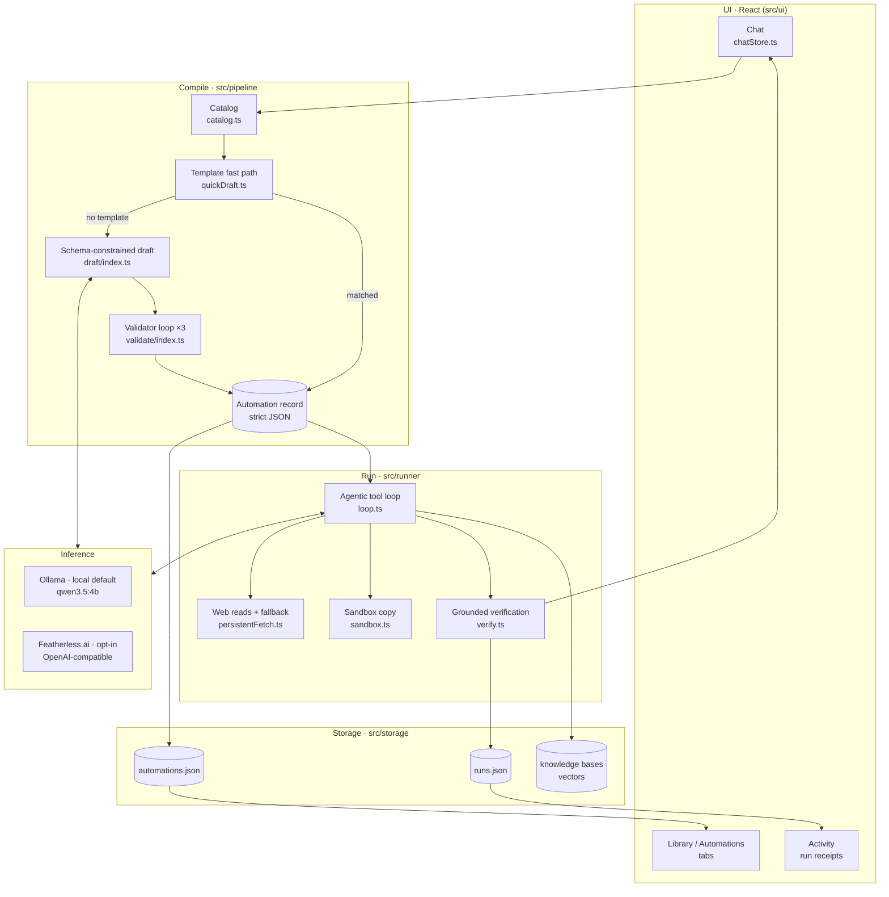
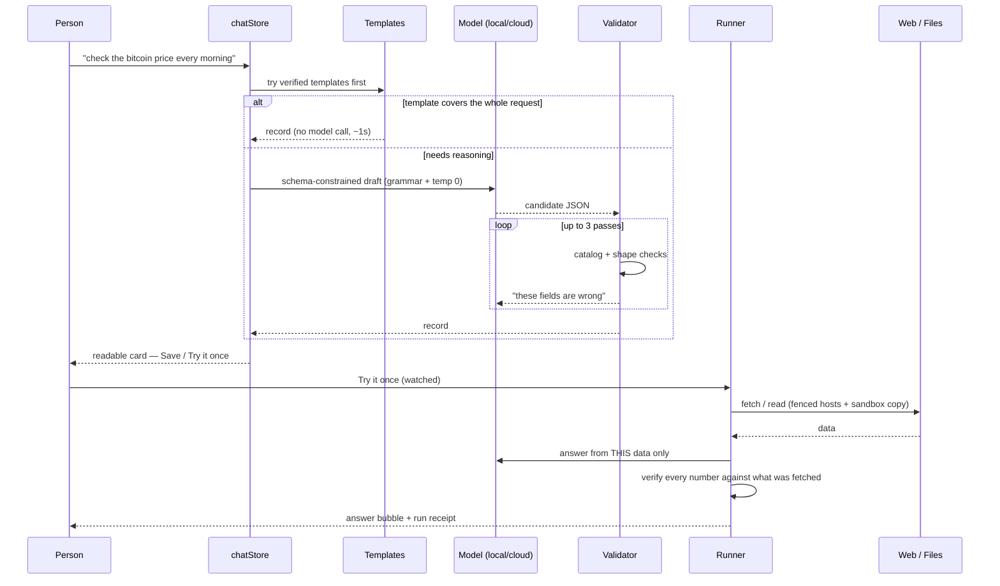

# Architecture

Private Pilot turns a sentence into an **automation record** — a small, strict
JSON document a person can read — and then runs that record inside a fence it
cannot talk its way out of. The model decides *what the job is*. It never
decides *what the app is allowed to touch*.

Everything here is enforced in TypeScript and Rust that we own. Prompts are
guidance; the fence is code.

---

## System at a glance

---

## The compile path: why the model can't invent a file

A request becomes a record through three gates.

**1 · The closed catalog** (`src/pipeline/catalog.ts`)
Before the model is asked anything, the app lists the real folders, the real
files, and the automations that already exist. Those become *enums inside the
JSON schema*. The model is not asked to be careful about filenames — it is
structurally unable to emit one that isn't on the machine. Online requests get
the file enums stripped, because embedding 150 paths into the grammar makes
local drafting materially slower for a job that touches no files.

**2 · Schema-constrained drafting** (`src/pipeline/draft/`)
The draft call sends a JSON Schema as Ollama's `format`, which llama.cpp
compiles to a decoding grammar: syntactically invalid JSON is unrepresentable,
not merely discouraged. The same schema is repeated in the prompt at
`temperature 0` — Ollama's own documented recommendation.

**3 · The validator loop** (`src/pipeline/validate/index.ts`)
Grammar guarantees shape, not sense. A zod schema built from the same catalog
re-checks the draft — hosts inside the fence, inputs that exist, no duplicate
names, chains that actually carry data — and hands the model a list of exactly
what was wrong, up to three passes. Two passes in there is an escape hatch: if
constrained decoding has failed twice, the model is allowed to think in plain
words first and the result is transcribed into the schema afterwards. Rules
that a model can't always satisfy are dropped on the final pass rather than
dead-ending the draft; anything still missing is repaired deterministically in
code.

---

## The run path: a fence, a copy, and a receipt

**Typed tools, bound per record.** A job that names no files never sees the
file tools; a job with no sources never sees the web tools
(`bindTools`, `src/runner/loop.ts`). The model chooses among tools it is
allowed to have, and the arguments are validated before anything executes.

**The fence is a function, not a sentence.** `fenceAllows()` compares the
request's hostname against the record's own `sources` *before* any fetch
leaves the app. A blocked host produces a designed refusal, not an exception.

**Files are copied, never edited in place.** `src/runner/sandbox.ts` stages a
copy; heavy tools (OCR, rename, zip, move) work only there. The person sees a
diff and presses **Keep** to apply or throws it away — so a wrong automation
costs a click, not a restore from backup.

**Blocked is not an answer.** `src/runner/persistentFetch.ts` walks a ladder
when a site pushes back: the same page in a real (cloaked, offscreen) browser →
a curated same-fact alternative (CoinGecko ↔ Coinbase ↔ Kraken, Nasdaq ↔
Yahoo, Google News ↔ HN/BBC) → only then a sentence naming every host tried.
Alternatives come from a hand-written table (`src/runner/mirrors.ts`) — never a
search result, never a host the model named — and every substitution is logged
into the run.

**Numbers are checked against the source.** `src/runner/verify.ts` extracts
every figure from the answer and looks for it in the corpus that was actually
fetched, allowing honest rounding and derivations (a sum, a count). A number
that appears nowhere stops the run. This is the difference between an
automation that reports and one that guesses.

---

## Inference: local by default, cloud by choice

| | Local | Cloud |
|---|---|---|
| Engine | Ollama (`qwen3.5:4b` default, `gemma4:12b` for vision) | Featherless.ai, OpenAI-compatible |
| Where data goes | stays on the machine | leaves the machine, per request |
| Default | **on** | **off** |
| Chosen by | Settings → Local AI, or the chat's brain picker | pasting a key, then picking a cloud model |

`src/providers/index.ts` is the single source of truth: **"cloud on" is
defined as "a Featherless model is the current brain."** There is no separate
toggle that can drift out of sync with the model picker, because the two were
one decision all along. `src/providers/featherless.ts` adds the parts a
desktop app actually needs — key sealed with Windows DPAPI, concurrency-aware
queueing, and the same `format`/structured-output contract the local path
uses, so one pipeline serves both brains.

Every run record stores `ranOn`, so the Activity feed can always answer "did
this leave my computer?" after the fact.

---

## Data model

Three atomic JSON stores under the app's data directory, each written
whole-file with a temp-and-rename so a crash cannot leave a half-written store:

- `automations.json` — records + version history (last ~10 per automation,
  which is what makes **Undo this change** possible)
- `chains.json` — sequences: members, links, conditions, pinned revisions
- `runs.json` — every run, with its stages, log lines, honesty events, and the
  answer

Knowledge bases live beside them (`kb/<slug>/`) as a manifest plus vectors,
built by `src/rag/` from documents the person filed and kept.

---

## Where to look in the code

| Question | File |
|---|---|
| How does a sentence become a record? | `src/pipeline/session.ts` |
| What can the model see? | `src/pipeline/catalog.ts` |
| How is the draft constrained? | `src/pipeline/draft/schema.ts` |
| How are bad drafts corrected? | `src/pipeline/validate/index.ts` |
| What tools can a run use? | `src/runner/loop.ts` (`bindTools`) |
| What stops a bad fetch? | `src/runner/fetchPage.ts` (`fenceAllows`) |
| What happens when a site blocks us? | `src/runner/persistentFetch.ts` |
| How are numbers checked? | `src/runner/verify.ts` |
| How do file changes stay safe? | `src/runner/sandbox.ts` + `src/runner/diff.ts` |
| How do sequences run? | `src/dispatcher/index.ts` |
| Local vs cloud routing | `src/providers/index.ts` |
| Native side (window, OCR, DPAPI) | `src-tauri/src/` |
